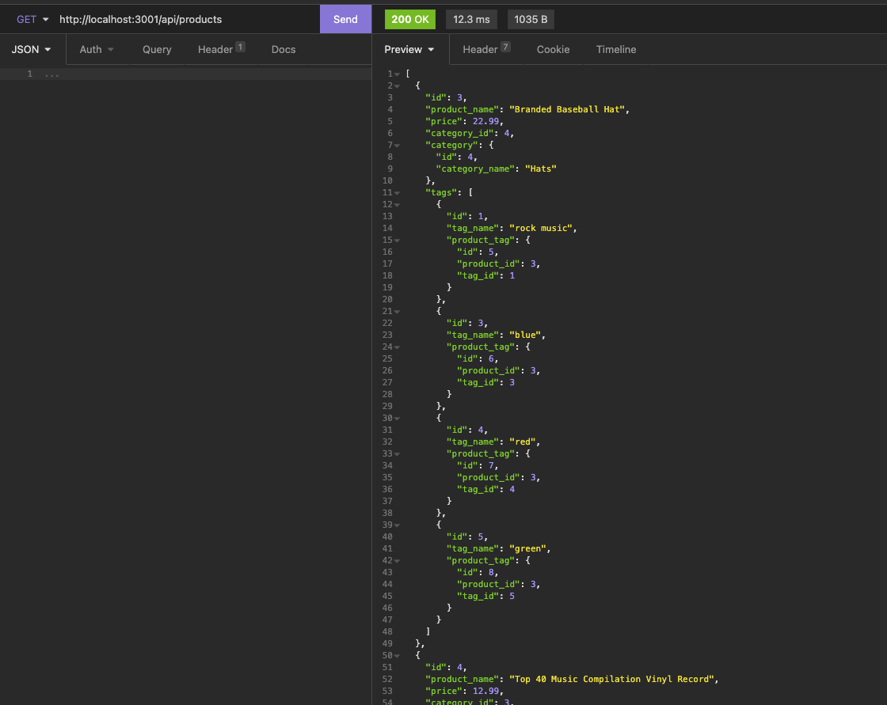
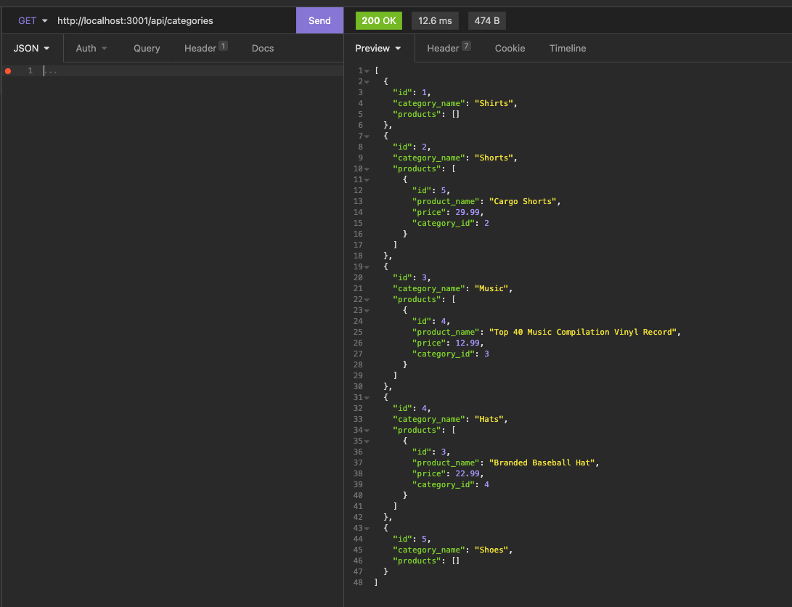
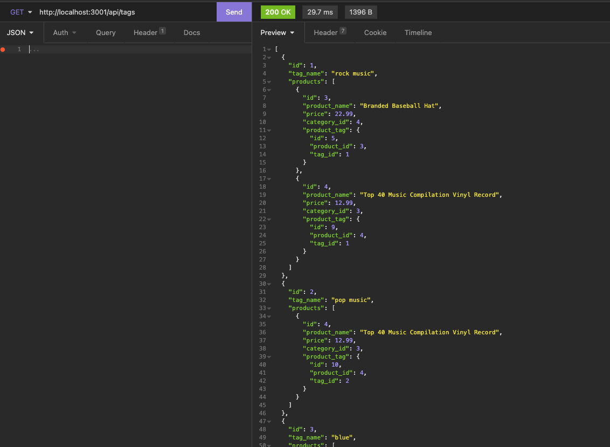
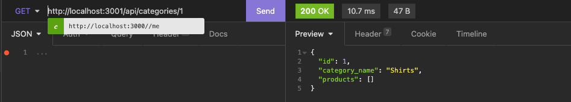
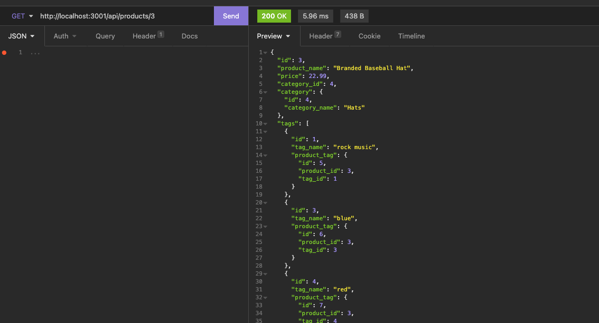
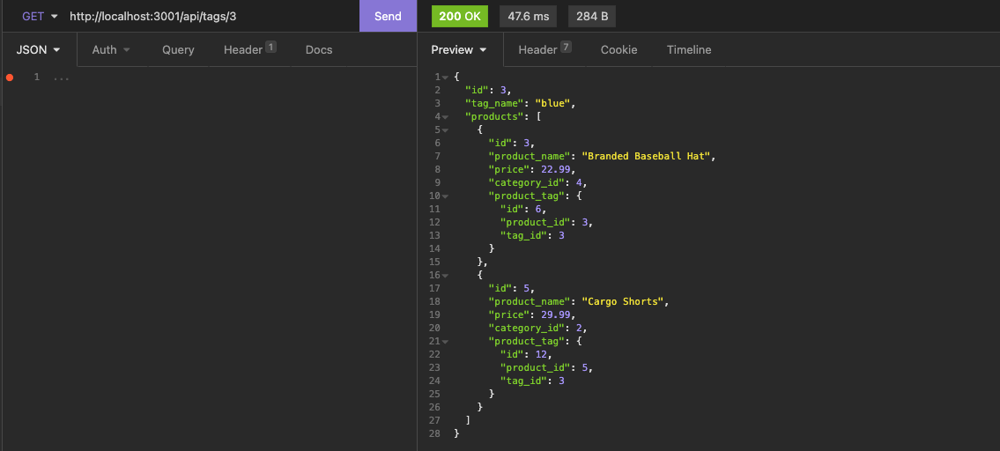

video link 
# E-COMMERCE BACK END
​
E-commercce Backe-End.Is a collection of API's created to allow frontend developers to 
have access to (CRUD) POST,DELETE, UPDATE AND GET  API calls.All functionality have been accomplished using MySQL 
database, Sequelize library and Express.js.

​

## Video Demo for all API Calls CRUD Functions
https://www.awesomescreenshot.com/video/7157595?key=bee89fab811df98a6492b50b430ce84c

## API Call to get a list of all products

## API Call to get a list of all categories

## API Call to get a list of Tags

## API Call to get a category by ID

## API Call to get a product by ID

## API Call to get a tag by ID
